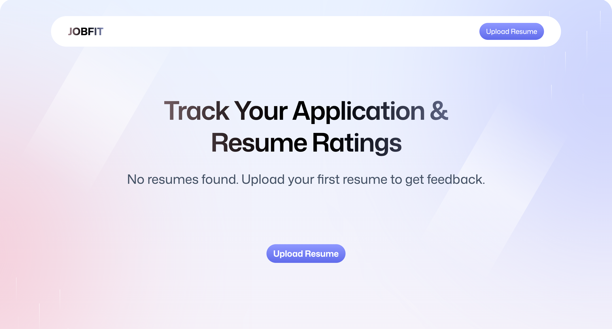
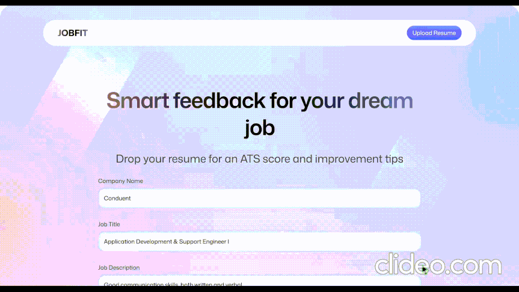
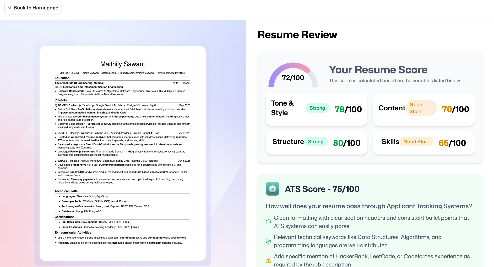
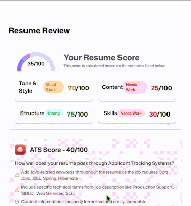
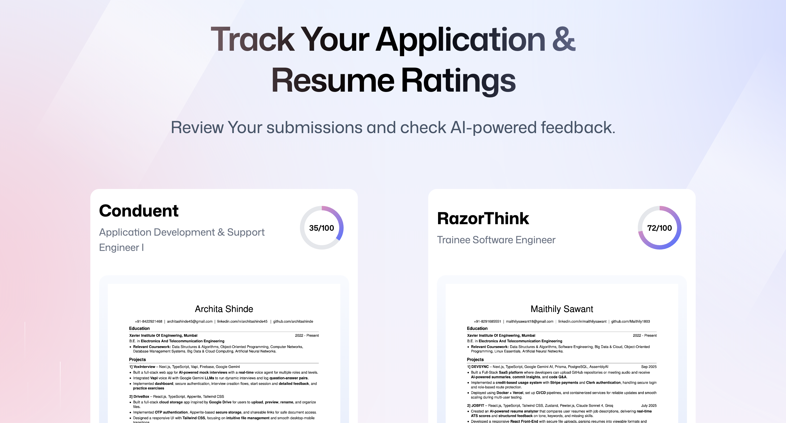
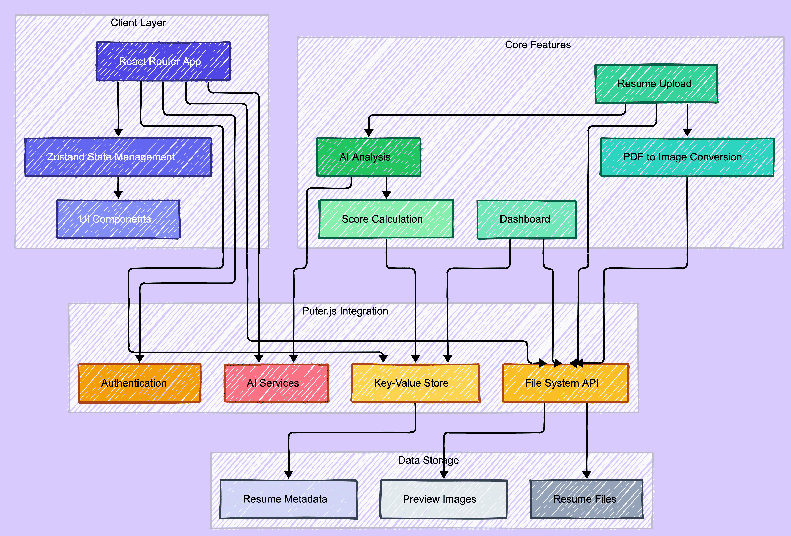
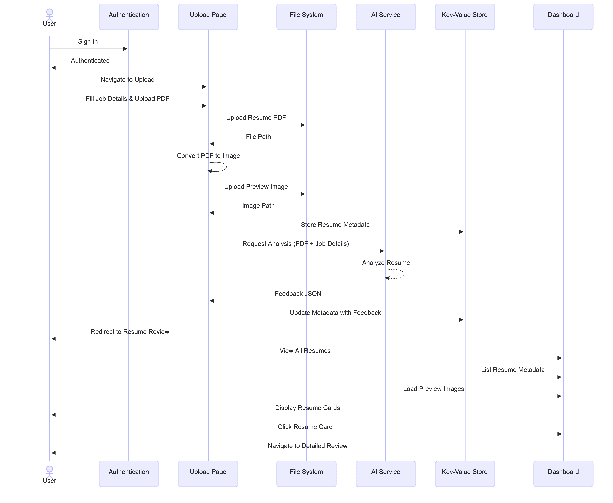

---
 
### **`Smart feedback for your dream job.`**

---

## 🧩 Dashboard

  

## 🎬 Product Tour

 
<strong>Upload Resume</strong>
   
  
 
 

 
<strong>Resume Score</strong>
   
  
 
 

 
<strong>Detailed Review</strong>
   
  
 

 
<strong>Multiple Resumes</strong>
   
  
 

---
## ✨ Features

**`AI Resume Analysis`**  
Evaluates resumes across Tone & Style, Content, Structure, Skills and ATS compatibility with clear score breakdowns and actionable insights.

**`ATS Optimization Score`**  
Generates a dedicated ATS score, identifies missing keywords and formatting issues and provides color-coded feedback for quick assessment.

**`Multi-Resume Tracking Dashboard`**  
Track and compare multiple resume submissions with visual cards, previews, overall scores and persistent storage.

___

## ⚙️ System Breakdown 

 
<strong> Architecture </strong>
   
  

 

 
<strong> Workflow </strong>
   
  

---
## 🛠️ Built with

  
  
  
  
  

  
  
  

---

## 👀 Explore JobFit. See the intelligence. ⭐ if it helps.
**`Made with ❤️ and ☕`**
